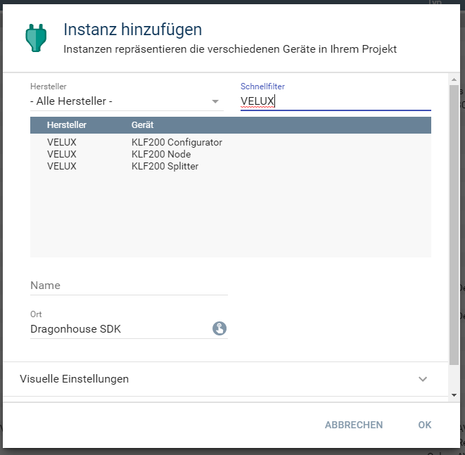
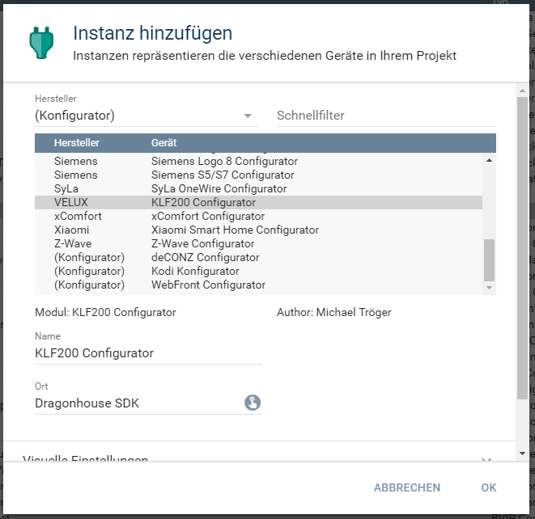
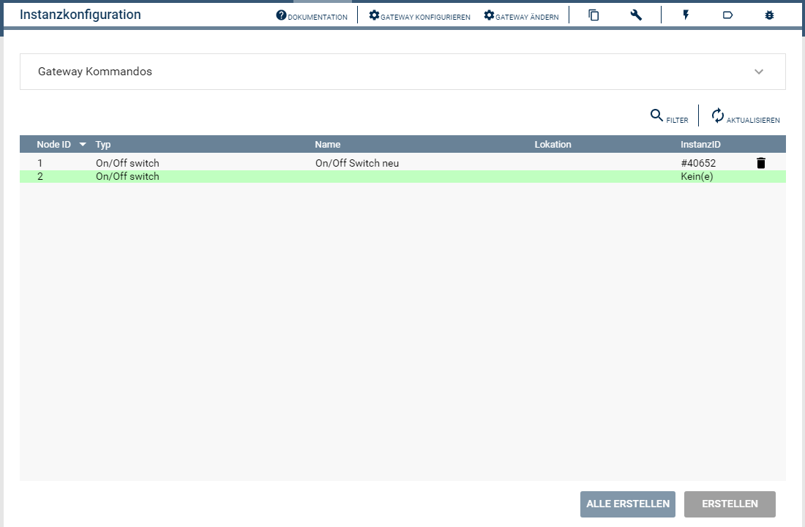
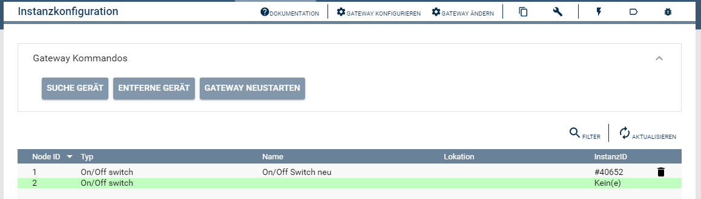
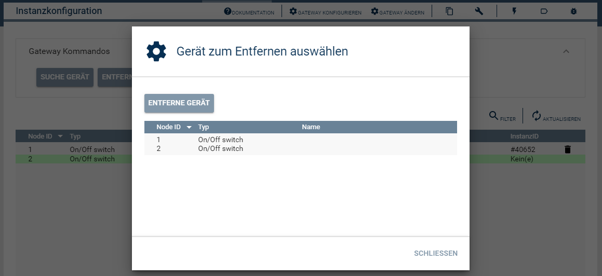

[](https://www.symcon.de/service/dokumentation/entwicklerbereich/sdk-tools/sdk-php/)
[]()
[](https://creativecommons.org/licenses/by-nc-sa/4.0/)  
[](https://www.symcon.de/forum/threads/41251-IP-Symcon-5-2-%28Testing%29)
[](https://styleci.io/repos/193268520)  

# Velux KLF200 Configurator  
Ermöglicht das Anlegen von Instanzen in IPS.  
An- und ablernen von Geräten im KLF200 Gateway.  

## Dokumentation

**Inhaltsverzeichnis**

1. [Funktionsumfang](#1-funktionsumfang) 
2. [Voraussetzungen](#2-voraussetzungen)
3. [Software-Installation](#3-software-installation)
4. [Einrichten der Instanzen in IP-Symcon](#4-einrichten-der-instanzen-in-ip-symcon)
5. [Statusvariablen und Profile](#5-statusvariablen-und-profile)
6. [Gateway Kommandos](#6-gateway-kommandos)
7. [PHP-Befehlsreferenz](#7-php-befehlsreferenz) 
8. [Lizenz](#8-lizenz)

## 1. Funktionsumfang

 - Auslesen und darstellen aller vom Gateway bekannten Geräte (Nodes).  
 - Einfaches Anlegen von neuen Instanzen in IPS.  
 - Anlernen und löschen von Nodes im Gateway.  

## 2. Voraussetzungen

 - IPS ab Version 5.2  
 - KLF200 io-homecontrol® Gateway  
    - KLF muss per LAN angeschlossen sein  
    - KLF Firmware 2.0.0.71 oder neuer  

## 3. Software-Installation

Dieses Modul ist ein Bestandteil des Symcon-Modul: [VeluxKLF200](../)  

## 4. Einrichten der Instanzen in IP-Symcon

Eine einfache Einrichtung ist über diese Instanz möglich.  
Bei der installation aus dem Store wird das anlegen der Instanz automatisch angeboten.  

In den sich öffnenen Konfigurationsfenstern ist das Passwort und die IP-Adresse bzw. der Hostname einzutragen.  
``Das Standardkennwort ist dasselbe wie das auf der Rückseite des KLF200 angegebene WLAN-Kennwort.``  

Bei der manuellen Einrichtung ist das Modul im Dialog 'Instanz hinzufügen' unter den Hersteller 'VELUX' zufinden.  
  

Alternativ ist es auch in der Liste alle Konfiguratoren aufgeführt.  
  

Es wird automatisch eine 'KLF200 Gateway' Instanz erzeugt, wenn noch keine vorhanden ist.  
Werden in dem sich öffnenden Konfigurationsformular keine Geräte angezeigt, so ist zuerst die IO-Instanz korrekt zu konfigurieren.  
Diese kann über die Schaltfläche 'Gateway konfigurieren' und dann 'Schnittstelle konfigurieren' erreicht werden.  

Ist die Gateway-Instanz korrekt verbunden, wird beim öffnen des Konfigurator folgendender Dialog angezeigt.  
  

Über das selektieren eines Eintrages in der Tabelle und betätigen des dazugehörigen 'Erstellen' Button,  
können Instanzen in IPS angelegt werden.  

## 5. Statusvariablen und Profile

Der Konfigurator besitzt keine Statusvariablen und Variablenprofile.  

## 6. Gateway Kommandos

In dem Konfigurator sind über den ersten Eintrag die Gateway Kommandos erreichbar.  
Mit den dort vorhandenen Schaltflächen können Geräte (Nodes) an dem Gateway an- un abgelernt werden, sowie das Gateway selber neugestartet werden.  
Durch die Schaltfläche 'Suche Gerät', wird die Gerätesuche gestartet. Alle Geräte welche sich im Anlern-Modus befinden werden hierduch an das Gateway angelernt.  
  

Über die Schaltfläche 'Entferne Gerät' wird eine Liste mit allen im Gateway vorhandenen Geräten (Nodes) angezeigt.  
Durch auswählen eines Eintrages und betätigen von 'Entferne Gerät' wird das Gerät aus dem Gateway gelöscht.  
  

## 7. PHP-Befehlsreferenz

**Folgende Funktionen liefern 'TRUE' bei Erfolg.  
Im Fehlerfall wird eine Warnung erzeugt und 'FALSE' zurückgegeben.**  

```php
bool KLF200_DiscoveryNodes(int $InstanzeID);
```
Sucht nach neuen Geräten und lernte Diese am Gateway an.  

```php
bool KLF200_RemoveNode(int $InstanzeID, int $Node);
```
Entfernt das angelernte Gerät mit der in '$Node' übergebenen Nodeid aus dem Gateway.    

```php
bool KLF200_RebootGateway(int $InstanzeID);
```
Startet das Gatway KLF200 neu.  


## 8. Lizenz

### IPS-Modul:  
  [CC BY-NC-SA 4.0](https://creativecommons.org/licenses/by-nc-sa/4.0/)  
  
### Submodules:  
  **PHP-TLS**  
  https://github.com/rnaga/PHP-TLS  
    Copyright (c) 2016 Ryohei Nagatsuka    

  **Pure PHP Elliptic Curve Cryptography Library**  
  https://github.com/phpecc/phpecc  

  **Assert**  
  https://github.com/beberlei/assert  
    Copyright (c) 2011-2013, Benjamin Eberlei, All rights reserved.  

  **AES GCM (Galois Counter Mode) PHP Implementation**  
  https://github.com/Spomky-Labs/php-aes-gcm  
    Copyright (c) 2016 Spomky-Labs  
