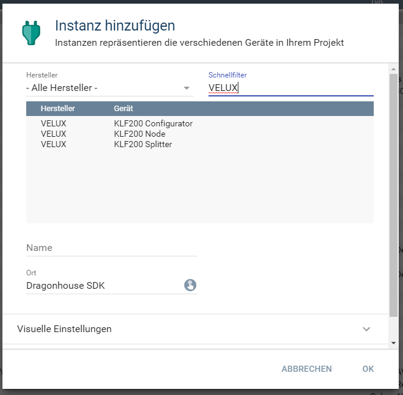

[](https://www.symcon.de/service/dokumentation/entwicklerbereich/sdk-tools/sdk-php/)
[]()
[](https://creativecommons.org/licenses/by-nc-sa/4.0/)  
[](https://www.symcon.de/forum/threads/41251-IP-Symcon-5-2-%28Testing%29)
[](https://styleci.io/repos/193268520)  

# Velux KLF200 Gateway  
Implementierung der API von dem Velux KLF200 Gateway.  

## Dokumentation

**Inhaltsverzeichnis**

1. [Funktionsumfang](#1-funktionsumfang) 
2. [Voraussetzungen](#2-voraussetzungen)
3. [Software-Installation](#3-software-installation)
4. [Einrichten der Instanzen in IP-Symcon](#4-einrichten-der-instanzen-in-ip-symcon)
5. [Statusvariablen und Profile](#5-statusvariablen-und-profile)
6. [WebFront](#6-webfront)
7. [PHP-Befehlsreferenz](#7-php-befehlsreferenz) 
8. [Lizenz](#8-lizenz)

## 1. Funktionsumfang

 - Bindeglied zwischen Netzwerk und IPS-Instanzen vom Type Node und Konfigurator.  
 - Auslesen und darstellen von Zuständes des KLF200.  

## 2. Voraussetzungen

 - IPS ab Version 5.2  
 - KLF200 io-homecontrol® Gateway  
    - KLF muss per LAN angeschlossen sein  
    - KLF Firmware 2.0.0.71 oder neuer  

## 3. Software-Installation

Dieses Modul ist ein Bestandteil des Symcon-Modul: [VeluxKLF200](../)  

## 4. Einrichten der Instanzen in IP-Symcon

Eine einfache Einrichtung ist über die im Objektbaum unter 'Konfigurator Instanzen' zu findene Instanz [KLF200 Konfigurator](../KLF200Configurator/README.md) möglich.  

Bei der manuellen Einrichtung ist das Modul im Dialog 'Instanz hinzufügen' unter den Hersteller 'VELUX' zufinden.  
  

Alternativ ist es auch in der Liste alle Splitter aufgeführt.  
  

In dem sich öffnenden Konfigurationsformular ist das Passwort einzutragen.  
``Das Standardkennwort ist dasselbe wie das auf der Rückseite des KLF200 angegebene WLAN-Kennwort.``  

## 5. Statusvariablen und Profile

 

**Statusvariablen bei Netzwerk-Geräten:**  

| Name                        | Typ     | Ident           | Beschreibung                                                   |
| :-------------------------: | :-----: | :-------------: | :------------------------------------------------------------: |
| Hardware Version            | integer | HardwareVersion | Hardware-Version des KLF200 Gateways.                          |
| Firmware Version            | string  | FirmwareVersion | Firmware-Version des KLF200 Gateways.                          |
| Protocol Version            | string  | ProtocolVersion | Version des aktuell unterstützen Protokolls des KLF200.        |

## 6. WebFront

Sollen die vorhandene Statusvariablen im WebFront angezeigt werden, so müssen diese verlinkt werden.  

## 7. PHP-Befehlsreferenz

**Folgende Funktionen liefern 'TRUE' bei Erfolg.  
Im Fehlerfall wird eine Warnung erzeugt und 'FALSE' zurückgegeben.**  

```php
bool KLF200_RequestGatewayVersion(int $InstanzeID);
```
Liest die Hard- und Firmware Version des Gateways, und speichert das Ergebnis in den Statusvariablen.  
Wird automatisch beim Verbinden mit dem Gateway ausgeführt.  

```php
bool KLF200_RequestProtocolVersion(int $InstanzeID);
```
Liest die Protokoll Version des Gateways, und speichert das Ergebnis in der Statusvariable.  
Wird automatisch beim Verbinden mit dem Gateway ausgeführt.  

```php
bool KLF200_SetGatewayTime(int $InstanzeID);
```
Schreibt die UTC Zeit in das Gateway.  
Wird automatisch beim Verbinden mit dem Gateway ausgeführt.  

```php
array KLF200_GetGatewayTime(int $InstanzeID);
```
Liest die aktuelle Zeit aus dem Gateway, und liefert ein Array mit folgenden Feldern.  
Es wird keine lokale Uhrzeit, und keine Sommerzeit unterstützt. Das bool-Feld 'DaylightSavingFlag' wird immer false sein.   
    'Timestamp',
    'Second',
    'Minute',
    'Hour',
    'DayOfMonth',
    'Month',
    'Year',
    'WeekDay',
    'DayOfYear',
    'DaylightSavingFlag'

## 8. Lizenz

### IPS-Modul:  
  [CC BY-NC-SA 4.0](https://creativecommons.org/licenses/by-nc-sa/4.0/)  
  
### Submodules:  
  **PHP-TLS**  
  https://github.com/rnaga/PHP-TLS  
    Copyright (c) 2016 Ryohei Nagatsuka    

  **Pure PHP Elliptic Curve Cryptography Library**  
  https://github.com/phpecc/phpecc  

  **Assert**  
  https://github.com/beberlei/assert  
    Copyright (c) 2011-2013, Benjamin Eberlei, All rights reserved.  

  **AES GCM (Galois Counter Mode) PHP Implementation**  
  https://github.com/Spomky-Labs/php-aes-gcm  
    Copyright (c) 2016 Spomky-Labs  
